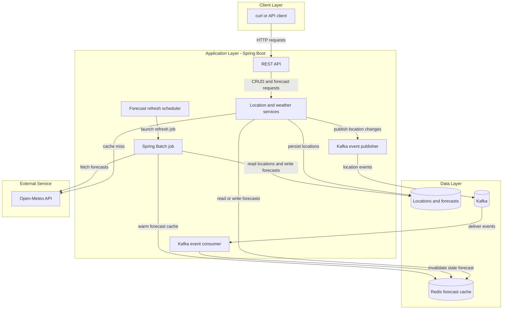
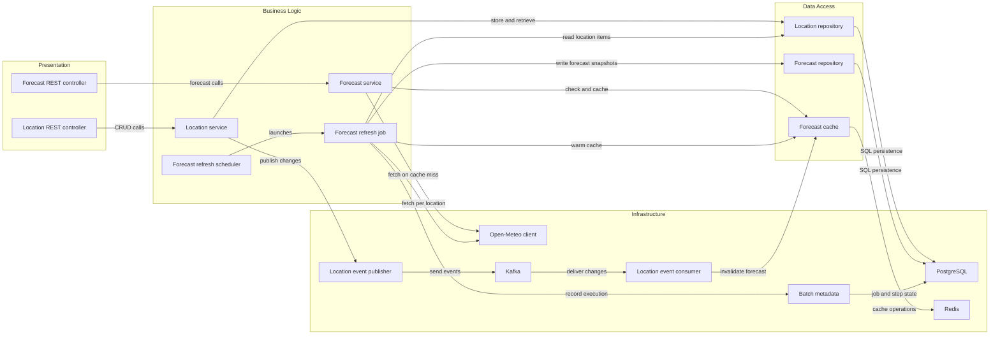

# Architecture Diagram

This is a proposed architecture for the Weather Watch interview showcase, based on the requested REST CRUD, Redis, Kafka, scheduled Spring Batch processing, and Open-Meteo integration. No application source code exists yet, so the components and technology versions below are design targets, not detected implementation facts.

## Application Architecture

<!-- mermaid-checked: no \n, no em-dash/en-dash, no {} in labels, subgraphs are id["label"], arrows are -->|"label"|, all subgraphs closed by end, ids unique -->

### Technology Stack Summary

| Layer | Technology | Version | Purpose |
|---|---|---|---|
| Application | Java and Spring Boot | TBD | REST endpoints, validation, services, and dependency wiring |
| Persistence | PostgreSQL | TBD | Durable saved-location records |
| Cache | Redis | TBD | Forecast response cache with TTL |
| Messaging | Kafka | TBD | Asynchronous location-change events |
| Scheduling and batch | Spring scheduling and Spring Batch | TBD | Periodically refresh forecasts for saved locations |
| External API | Open-Meteo | Public API | Forecast data by latitude and longitude |

### Data Storage & External Services

PostgreSQL is the source of truth for saved locations and persisted forecast snapshots. Redis holds disposable forecast responses and can be repopulated after expiry or invalidation. Kafka carries location-change events so cache invalidation is decoupled from the request path. On a forecast cache miss, the application can use a suitable persisted forecast or call Open-Meteo through a provider adapter. A scheduler launches a Spring Batch job that reads locations in chunks, retrieves forecasts, writes snapshots, and warms Redis.

### Key Architectural Decisions

- Use a cache-aside forecast flow: read Redis first, call Open-Meteo on a miss, and cache successful results for a bounded TTL.
- Publish location changes to Kafka and make the consumer idempotent because duplicate delivery is possible.
- Separate scheduling from batch processing: the scheduler triggers a job, while Spring Batch owns job metadata, chunk processing, and restart behavior.
- Keep external API and broker details behind application components; use deterministic provider responses in automated tests.

## Component Relationships

The component diagram is also a target design. Component names describe intended responsibilities and may change when the code is created.

<!-- mermaid-checked: no \n, no em-dash/en-dash, no {} in labels, subgraphs are id["label"], arrows are -->|"label"|, all subgraphs closed by end, ids unique -->

### Component Inventory

| Component | Layer | Type | Responsibility |
|---|---|---|---|
| Location REST controller | Presentation | REST controller | Expose saved-location CRUD endpoints |
| Forecast REST controller | Presentation | REST controller | Expose forecast lookup endpoint |
| Location service | Business Logic | Application service | Validate and coordinate location changes |
| Forecast service | Business Logic | Application service | Implement cache-aside forecast retrieval |
| Location repository | Data Access | Repository | Persist and retrieve locations |
| Forecast repository | Data Access | Repository | Persist and retrieve forecast snapshots |
| Forecast cache | Data Access | Cache adapter | Read, write, and invalidate forecast entries |
| Forecast refresh scheduler | Business Logic | Scheduled trigger | Launch the refresh job at a configurable interval |
| Forecast refresh job | Business Logic | Spring Batch job | Read locations, fetch forecast data, persist snapshots, and warm cache |
| Open-Meteo client | Infrastructure | HTTP client adapter | Call the public forecast API |
| Location event publisher | Infrastructure | Kafka producer | Publish location-change events |
| Location event consumer | Infrastructure | Kafka listener | Consume events and invalidate cached forecasts |
| Batch metadata | Infrastructure | Spring Batch repository | Track job and step executions for restart and diagnosis |
| Kafka | Infrastructure | Message broker | Deliver location-change events |
| PostgreSQL | Infrastructure | Relational database | Store durable location records |
| Redis | Infrastructure | Cache | Store forecast responses with a TTL |
