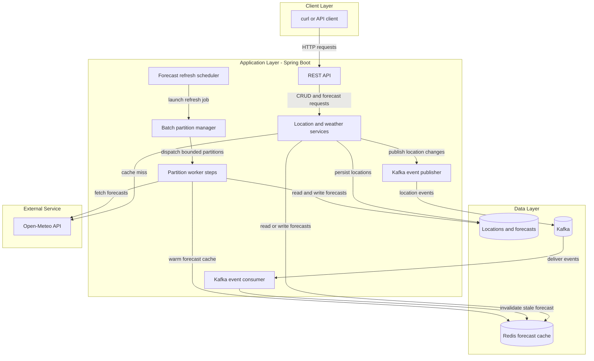
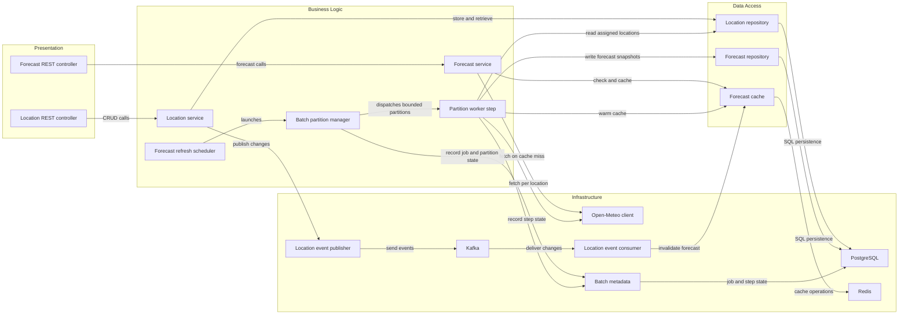

# Architecture Diagram

This describes the current Weather Watch scaffold and its proposed target architecture. Saved-location REST CRUD and PostgreSQL persistence are implemented; Redis caching, Kafka events, Open-Meteo integration, and scheduled partitioned Spring Batch processing remain design targets.

## Application Architecture

<!-- mermaid-checked: no \n, no em-dash/en-dash, no {} in labels, subgraphs are id["label"], arrows are -->|"label"|, all subgraphs closed by end, ids unique -->

### Technology Stack Summary

| Layer | Technology | Version | Purpose |
|---|---|---|---|
| Application | Java 21 and Spring Boot 3.5.6 in a Docker image | 21 / 3.5.6 | REST endpoints, validation, services, and dependency wiring |
| Local runtime | Docker Compose | Compose v2 | Run the application and local dependencies as an isolated, repeatable stack |
| Persistence | PostgreSQL container with Flyway migrations | 17.6 | Durable saved-location and forecast records |
| Cache | Redis container | 7.4.2 | Forecast response cache with TTL |
| Messaging | Kafka container | 3.9.1 | Asynchronous location-change events |
| Scheduling and batch | Spring scheduling and partitioned Spring Batch | TBD | Periodically refresh forecasts using bounded parallel location partitions |
| External API | Open-Meteo | Public API | Forecast data by latitude and longitude |

### Data Storage & External Services

PostgreSQL is the source of truth for saved locations and persisted forecast snapshots. Redis holds disposable forecast responses and can be repopulated after expiry or invalidation. Kafka carries location-change events so cache invalidation is decoupled from the request path. On a forecast cache miss, the application can use a suitable persisted forecast or call Open-Meteo through a provider adapter. A scheduler launches a Spring Batch partitioned job: a manager creates deterministic location-ID partitions and bounded worker steps process each partition in chunks, retrieve forecasts, write snapshots, and warm Redis.

### Key Architectural Decisions

- Use a cache-aside forecast flow: read Redis first, call Open-Meteo on a miss, and cache successful results for a bounded TTL.
- Publish location changes to Kafka and make the consumer idempotent because duplicate delivery is possible.
- Separate scheduling from batch processing: the scheduler triggers a job, while Spring Batch owns job metadata, chunk processing, partition boundaries, and restart behavior.
- Partition batch work by deterministic location-ID ranges and cap worker concurrency to control database pressure and external API request rates.
- Keep external API and broker details behind application components; use deterministic provider responses in automated tests.

## Component Relationships

The location REST controller, service, repository, request/response DTOs, and database migration exist. Other components in the diagram describe intended responsibilities and have not yet been implemented.

<!-- mermaid-checked: no \n, no em-dash/en-dash, no {} in labels, subgraphs are id["label"], arrows are -->|"label"|, all subgraphs closed by end, ids unique -->

### Component Inventory

| Component | Layer | Type | Responsibility |
|---|---|---|---|
| Location REST controller | Presentation | REST controller | Expose saved-location CRUD endpoints |
| Forecast REST controller | Presentation | REST controller | Expose forecast lookup endpoint |
| Location service | Business Logic | Application service | Validate and coordinate location changes |
| Forecast service | Business Logic | Application service | Implement cache-aside forecast retrieval |
| Location repository | Data Access | Repository | Persist and retrieve locations |
| Forecast repository | Data Access | Repository | Persist and retrieve forecast snapshots |
| Forecast cache | Data Access | Cache adapter | Read, write, and invalidate forecast entries |
| Forecast refresh scheduler | Business Logic | Scheduled trigger | Launch the partitioned refresh job at a configurable interval |
| Batch partition manager | Business Logic | Spring Batch manager step | Create deterministic location partitions and dispatch bounded worker steps |
| Partition worker step | Business Logic | Spring Batch worker step | Process assigned locations, fetch forecasts, persist snapshots, and warm cache |
| Open-Meteo client | Infrastructure | HTTP client adapter | Call the public forecast API |
| Location event publisher | Infrastructure | Kafka producer | Publish location-change events |
| Location event consumer | Infrastructure | Kafka listener | Consume events and invalidate cached forecasts |
| Batch metadata | Infrastructure | Spring Batch repository | Track job and step executions for restart and diagnosis |
| Kafka | Infrastructure | Message broker | Deliver location-change events |
| PostgreSQL | Infrastructure | Relational database | Store durable location records |
| Redis | Infrastructure | Cache | Store forecast responses with a TTL |
