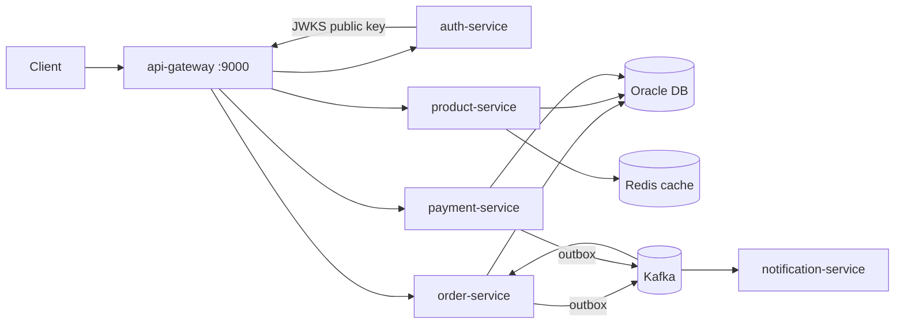

# Order Management Platform

A microservices-based order processing system demonstrating production-grade
backend engineering: hexagonal architecture, transactional outbox, Oracle with
performance-tuned SQL, Kafka eventing, and full CI/CD.

## Architecture



## Services

| Service | Port | Responsibility |
|---|---|---|
| api-gateway | 9000 | Spring Cloud Gateway: edge JWT validation, routing, CORS |
| auth-service | 8084 | RS256 JWT issuing, JWKS endpoint, demo users |
| order-service | 8080 | Order lifecycle, Oracle persistence, outbox → Kafka |
| product-service | 8081 | Product catalog, Redis cache-aside |
| payment-service | 8082 | Strategy-pattern payments, `payment.paid` events |
| notification-service | 8083 | Consumes order events, notifies customers |

Infrastructure: Oracle 23ai Free, Kafka (KRaft), Redis, plus observability —
Prometheus (:9090), Grafana (:3000, admin/admin), Jaeger (:16686); the OTel
collector is internal-only.

## Key design decisions

- **Hexagonal architecture** (enforced by ArchUnit tests): domain has zero
  framework dependencies; use cases depend only on ports.
- **Transactional outbox**: order writes and event writes share one DB
  transaction; a relay publishes to Kafka — no dual-write inconsistency.
- **At-least-once delivery + idempotent consumers**: order-service dedupes
  events in a transactional inbox (`processed_events`, claim + state change in
  one DB transaction); notification-service uses Redis SETNX with TTL and
  fails open on Redis outage.
- **Resilience4j on inter-service calls**: order-service prices orders from
  the catalog (client-supplied prices are not trusted), wrapped in retry +
  circuit breaker. Unknown product fails closed (400); catalog outage fails
  open (client price + WARN) — the policy lives in the use case, not the
  HTTP client adapter.
- **Oracle tuning**: indexed FKs, function-based partial index on the outbox,
  `NUMBER(12,2)` money columns, HikariCP pool sizing.
- **OAuth2/JWT security**: auth-service issues RS256 tokens and publishes its
  public key via JWKS; the gateway validates at the edge and every service
  re-validates independently (defense in depth). Roles live in a custom
  `roles` claim mapped to `ROLE_*` authorities per service.
- **Observability**: every service exposes Prometheus metrics (scraped on the
  internal Docker network, never through the gateway) and ships OTLP traces
  through an OpenTelemetry collector to Jaeger. Grafana is provisioned with
  a RED/USE dashboard (HTTP rate/p95, JVM heap, circuit breaker state,
  Kafka lag, HikariCP). Trace IDs appear in log lines for log↔trace
  correlation.

## Quick start

```bash
docker compose up --build
```

Then log in and create an order through the gateway:

```bash
TOKEN=$(curl -s -X POST http://localhost:9000/auth/login \
  -H "Content-Type: application/json" \
  -d '{"username":"alice","password":"password"}' | sed 's/.*"accessToken":"\([^"]*\)".*/\1/')

curl -X POST http://localhost:9000/api/v1/orders \
  -H "Authorization: Bearer $TOKEN" \
  -H "Content-Type: application/json" \
  -d '{
    "customerId": "11111111-1111-1111-1111-111111111111",
    "lines": [
      {"productId": "22222222-2222-2222-2222-222222222222", "quantity": 2, "unitPrice": 10.00}
    ]
  }'
```

Demo users (password `password`): `alice` = CUSTOMER, `bob` = ADMIN,
`carol` = both.

Full walkthroughs per milestone: [docs/e2e/](docs/e2e/README.md)

## Development

```bash
mvn verify          # build + unit tests + JaCoCo coverage
```

## Cleanup / removal

Everything runs inside Docker — nothing is installed on the host.

```bash
docker compose down                        # remove containers + network (keeps images, volumes)
docker compose down --volumes              # also remove volumes (DB data)
docker compose down --rmi all --volumes    # also remove all images (full wipe)
docker builder prune                       # clear build cache from --build
```

Local build artifacts (`target/` folders) come from running Maven locally, not from
Docker — delete them manually if you want a fully clean workspace:

```bash
mvn clean                     # or: find . -type d -name target -prune -exec rm -rf {} +
```

## Roadmap

- [x] Idempotent consumers: transactional inbox + Redis SETNX dedupe
- [x] Resilience4j circuit breaker + retry on catalog calls (fail-open on outage, fail-closed on unknown product)
- [x] Prometheus/Grafana + OpenTelemetry tracing
- [ ] Kubernetes Helm chart with HPA
- [ ] k6 load tests + SQL EXPLAIN PLAN case study

## Known limitations

- Auth is a demo issuer: in-memory users, RSA keypair regenerated on restart
  (tokens don't survive an auth-service restart); no refresh tokens
- No per-customer authorization on order reads (any authenticated
  CUSTOMER/ADMIN can read any order by id)
- Notification consumer logs instead of sending real notifications
