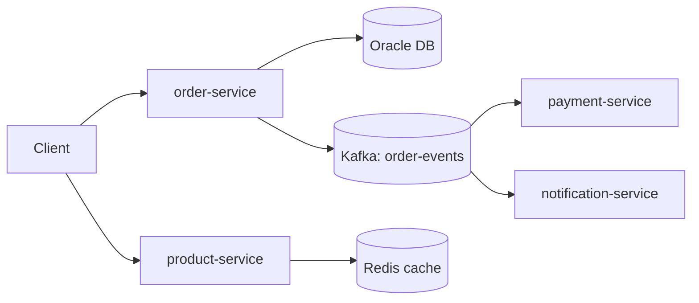

# Order Management Platform

A microservices-based order processing system demonstrating production-grade
backend engineering: hexagonal architecture, transactional outbox, Oracle with
performance-tuned SQL, Kafka eventing, and full CI/CD.

## Architecture



## Services

| Service | Port | Responsibility |
|---|---|---|
| order-service | 8080 | Order lifecycle, Oracle persistence, outbox → Kafka |
| product-service | 8081 | Product catalog, Redis caching |
| payment-service | 8082 | Consumes order events, processes payments |
| notification-service | 8083 | Consumes order events, notifies customers |

## Key design decisions

- **Hexagonal architecture** (enforced by ArchUnit tests): domain has zero
  framework dependencies; use cases depend only on ports.
- **Transactional outbox**: order writes and event writes share one DB
  transaction; a relay publishes to Kafka — no dual-write inconsistency.
- **At-least-once delivery + idempotent consumers**: consumers dedupe by orderId.
- **Oracle tuning**: indexed FKs, function-based partial index on the outbox,
  `NUMBER(12,2)` money columns, HikariCP pool sizing.

## Quick start

```bash
docker compose up --build
```

Then create an order:

```bash
curl -X POST http://localhost:8080/api/v1/orders \
  -H "Content-Type: application/json" \
  -d '{
    "customerId": "11111111-1111-1111-1111-111111111111",
    "lines": [
      {"productId": "22222222-2222-2222-2222-222222222222", "quantity": 2, "unitPrice": 10.00}
    ]
  }'
```

## Development

```bash
mvn verify          # build + unit tests + JaCoCo coverage
```

## Roadmap

- [ ] Payment processing with Strategy pattern (card, wallet, bank transfer)
- [ ] API Gateway + JWT auth
- [ ] Prometheus/Grafana + OpenTelemetry tracing
- [ ] Kubernetes Helm chart with HPA
- [ ] k6 load tests + SQL EXPLAIN PLAN case study

## Known limitations

- Product catalog is in-memory placeholder (Oracle + Redis cache pending)
- Kafka consumer handlers are stubs pending payment/notification logic
- No auth yet — planned as OAuth2 resource servers
