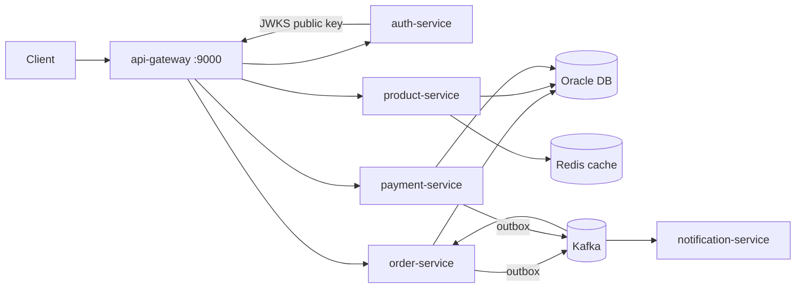

# Order Management Platform

A microservices-based order processing system demonstrating production-grade
backend engineering: hexagonal architecture, transactional outbox, Oracle with
performance-tuned SQL, Kafka eventing, and production-oriented delivery.

## Architecture



## Services

| Service | Port | Responsibility |
|---|---|---|
| api-gateway | 9000 | Spring Cloud Gateway: edge JWT validation, routing, CORS |
| auth-service | 8084 | RS256 JWT issuing, JWKS endpoint, demo users |
| order-service | 8080 | Order lifecycle, Oracle persistence, outbox → Kafka |
| product-service | 8081 | Product catalog, Redis cache-aside |
| payment-service | 8082 | Strategy-pattern payments, `payment.paid` events |
| notification-service | 8083 | Consumes order events, notifies customers |

Infrastructure: Oracle 23ai Free, Kafka (KRaft), Redis, plus observability —
Prometheus (:9090), Grafana (:3000, admin/admin), Jaeger (:16686); the OTel
collector is internal-only.

## Key design decisions

- **Hexagonal architecture** (enforced by ArchUnit tests): domain has zero
  framework dependencies; use cases depend only on ports.
- **Transactional outbox**: order writes and event writes share one DB
  transaction; a relay publishes to Kafka — no dual-write inconsistency.
- **At-least-once delivery + idempotent consumers**: order-service dedupes
  events in a transactional inbox (`processed_events`, claim + state change in
  one DB transaction); notification-service uses Redis SETNX with TTL and
  fails open on Redis outage.
- **Saga orchestration (planned)**: the current payment event flow is
  intentionally not presented as a Saga. A later milestone will coordinate
  inventory reservation, payment, and fulfillment with durable process state
  and compensating actions.
- **Resilience4j on inter-service calls**: order-service prices orders from
  the catalog (client-supplied prices are not trusted), wrapped in retry +
  circuit breaker. Unknown product fails closed (400); catalog outage fails
  open (client price + WARN) — the policy lives in the use case, not the
  HTTP client adapter.
- **Oracle tuning**: indexed FKs, function-based partial index on the outbox,
  `NUMBER(12,2)` money columns, HikariCP pool sizing.
- **OAuth2/JWT security**: auth-service issues RS256 tokens and publishes its
  public key via JWKS; the gateway validates at the edge and every service
  re-validates independently (defense in depth). Roles live in a custom
  `roles` claim mapped to `ROLE_*` authorities per service.
- **Authentication scope**: this is a custom JWT issuer plus OAuth2 resource
  servers, not a complete OAuth2/OIDC authorization server. It deliberately
  does not yet implement authorization-code flow, PKCE, refresh tokens,
  consent, client registration, token revocation/introspection, or persistent
  signing-key rotation.
- **Observability**: every service exposes Prometheus metrics (scraped on the
  internal Docker network, never through the gateway) and ships OTLP traces
  through an OpenTelemetry collector to Jaeger. Grafana is provisioned with
  a RED/USE dashboard (HTTP rate/p95, JVM heap, circuit breaker state,
  Kafka lag, HikariCP). Trace IDs appear in log lines for log↔trace
  correlation.

## Quick start

```bash
docker compose up --build
```

Then log in and create an order through the gateway:

```bash
TOKEN=$(curl -s -X POST http://localhost:9000/auth/login \
  -H "Content-Type: application/json" \
  -d '{"username":"alice","password":"password"}' | sed 's/.*"accessToken":"\([^"]*\)".*/\1/')

curl -X POST http://localhost:9000/api/v1/orders \
  -H "Authorization: Bearer $TOKEN" \
  -H "Content-Type: application/json" \
  -d '{
    "customerId": "11111111-1111-1111-1111-111111111111",
    "lines": [
      {"productId": "22222222-2222-2222-2222-222222222222", "quantity": 2, "unitPrice": 10.00}
    ]
  }'
```

Demo users (password `password`): `alice` = CUSTOMER, `bob` = ADMIN,
`carol` = both.

Full walkthroughs per milestone: [docs/e2e/](docs/e2e/README.md)

## Documentation map

| Doc | What it covers |
|---|---|
| [docs/e2e/README.md](docs/e2e/README.md) | Index of per-milestone E2E reproduction guides (curl, pre/post-conditions, gotchas) |
| [docs/progress.md](docs/progress.md) | Milestone tracker: done items, release tags, backlog |
| [deploy/helm/order-platform/README.md](deploy/helm/order-platform/README.md) | Kubernetes deployment: prerequisites, Helm install, probes/HPA design decisions |
| [docs/notes.md](docs/notes.md) | Strategy notes & job-requirement mapping |

## Development

```bash
mvn verify          # build + unit tests + JaCoCo coverage
```

## Cleanup / removal

Everything runs inside Docker — nothing is installed on the host for the
compose stack. (The Kubernetes deployment adds `helm` via winget — see the
[prerequisites table](deploy/helm/order-platform/README.md) for what goes
where and how to remove it.)

```bash
docker compose down                        # remove containers + network (keeps images, volumes)
docker compose down --volumes              # also remove volumes (DB data)
docker compose down --rmi all --volumes    # also remove all images (full wipe)
docker builder prune                       # clear build cache from --build
```

Local build artifacts (`target/` folders) come from running Maven locally, not from
Docker — delete them manually if you want a fully clean workspace:

```bash
mvn clean                     # or: find . -type d -name target -prune -exec rm -rf {} +
```

## Roadmap

This platform must demonstrate each backend concept below end to end. A checked
item has reproducible implementation and verification evidence; an unchecked
item is required work, not an optional limitation.

| Topic | How this project demonstrates it | Completion status |
|---|---|---|
| Synchronous programming | Gateway-routed REST commands and queries, request validation, transactional Oracle writes, and synchronous order-to-catalog/payment interactions with explicit error contracts | Complete |
| Asynchronous programming | Transactional outbox relays publish Kafka events; payment and notification consumers process at-least-once delivery idempotently | Complete |
| Design patterns | Hexagonal architecture, repository ports/adapters, payment Strategy dispatch, transactional outbox, transactional inbox, cache-aside, and circuit-breaker/retry policies | Complete |
| Saga pattern | An orchestrated order workflow will reserve inventory, charge payment, and request fulfillment; failures will compensate completed steps by releasing inventory and refunding/reversing payment where appropriate | Required |
| Containerization | Multi-stage, non-root service images and a Docker Compose environment for Oracle, Kafka, Redis, observability, and all services | Complete |
| Orchestration | Helm chart, probes, resource limits, HPA, and a minikube deployment verified through the in-cluster gateway | Complete |
| CI/CD | GitHub Actions must verify builds/tests and publish immutable images to GHCR; an approved deployment workflow must deploy a pinned image to a configured staging cluster, run smoke tests, and support rollback | Required |
| Multithreading and concurrency | Virtual threads and scheduled outbox work are enabled; complete this with bounded Kafka-listener concurrency, race-safe idempotent processing, deterministic concurrent-request tests, and a flash-sale inventory-reservation workflow | Required |
| Caching | Redis cache-aside product reads with TTL, evict-on-write invalidation, and an explicit fail-open outage policy | Complete |
| OAuth2/OIDC authorization server | Replace the custom issuer with a standards-based authorization server supporting authorization-code flow with PKCE, OIDC discovery and UserInfo, registered clients, persistent signing keys with rotation, refresh-token rotation, and issuer/audience/scope validation by resource servers | Required |
| Resource efficiency and capacity | Run a repeatable, laptop-sized workload under fixed Docker Compose or minikube limits; capture CPU, memory, GC, connection-pool, Kafka-lag, throughput, and latency baselines before and after one measured improvement | Required |

- [x] Idempotent consumers: transactional inbox + Redis SETNX dedupe
- [x] Resilience4j circuit breaker + retry on catalog calls (fail-open on outage, fail-closed on unknown product)
- [x] Prometheus/Grafana + OpenTelemetry tracing
- [x] Kubernetes Helm chart with HPA — deployed to minikube, E2E verified ([guide](docs/e2e/e2e-v0.8.0.md))
- [x] k6 load tests + SQL EXPLAIN PLAN case study ([guide](docs/e2e/e2e-v0.9.0.md))
- [x] PIT mutation testing for order-service, payment-service, and product-service ([guide](docs/e2e/e2e-v0.10.0.md))
- [ ] Saga orchestration: add durable order-process state for inventory reservation → payment → fulfillment; implement idempotent commands/events, timeouts/retries, and compensations (release inventory and refund/reverse payment); E2E-verify successful, rejected, and post-payment failure paths
- [ ] CI/CD delivery: publish immutable multi-service images to GHCR; add an approved, pinned-image Helm deployment workflow for a configured staging cluster; verify smoke tests and documented rollback
- [ ] Multithreading/concurrency: configure bounded Kafka consumer concurrency with partition-order guarantees; prove race-safe idempotent payment/event processing with coordinated concurrent-request tests; capture virtual-thread, listener, and database-pool metrics
- [ ] Flash-sale inventory reservation: implement limited-stock reservation with an authoritative atomic inventory decrement, idempotency keys, reservation expiry/release, oversell prevention, contention controls, and a high-parallelism E2E/load test proving that successful reservations never exceed available stock
- [ ] Full regression revalidation: after the Saga, CI/CD, concurrency, and flash-sale milestones, rerun Maven verification, focused PIT, Docker Compose and Kubernetes gateway E2E flows, observability checks, and k6 workloads; update affected guides with actual results
- [ ] OAuth2/OIDC authorization server: replace the custom token issuer with a mature standards-based implementation; support authorization-code flow with PKCE, registered clients, OIDC discovery/UserInfo, persistent signing keys and safe key rotation, refresh-token rotation, and issuer/audience/scope validation; E2E-verify authorization, expiry, insufficient scope, refresh rotation/reuse rejection, and key rotation without breaking valid requests
- [ ] Resource-efficiency/capacity case study: define and record the laptop hardware, Docker Desktop/minikube allocation, JVM/container limits, dataset, warm-up, VUs, duration, and background-load conditions; capture comparable baseline and post-change CPU, container/process memory, GC, HikariCP, Kafka lag, throughput, p50/p95/p99, failures, and Kubernetes CPU-throttling/HPA data where available; document one measured improvement or an honest negative result without claiming production-scale capacity
- [ ] ADRs: document Kafka versus RabbitMQ, the transactional outbox, Saga orchestration, and the selected flash-sale concurrency/consistency strategy after those implementations are complete

## Known limitations

- Auth is a demo issuer: in-memory users, RSA keypair regenerated on restart
  (tokens don't survive an auth-service restart); no refresh tokens
- No per-customer authorization on order reads (any authenticated
  CUSTOMER/ADMIN can read any order by id)
- Notification consumer logs instead of sending real notifications
