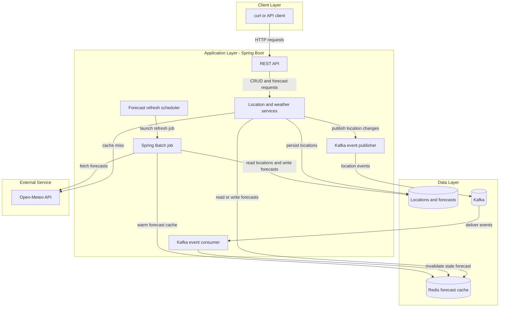

# Weather Watch

A small, disposable Spring Boot project proposal for a senior-engineering interview. It will demonstrate a REST API with CRUD, PostgreSQL persistence, Redis caching, Kafka events, scheduled Spring Batch forecast ingestion, and integration with the public [Open-Meteo API](https://open-meteo.com/).

> **Status:** Planning only. This repository currently has no application source code. The design below describes the intended project, not features that are already implemented.
>
> **Project lifecycle:** This is an isolated interview showcase, not a production feature. It is not intended to be merged into `main` and may be deleted after the interview. These documents do not create Git isolation: the current workspace is inside an existing repository. Keep implementation in a separate disposable working copy if strict repository isolation is required.

## What we'll build

Users will manage saved weather locations through a small REST API. The application will store locations and forecast snapshots in PostgreSQL, retrieve forecasts from Open-Meteo, cache forecasts in Redis, and publish location-change events to Kafka. A scheduler will launch a Spring Batch job to refresh forecasts for saved locations on a configurable interval. The scope is intentionally limited so the end-to-end behavior is easy to run and explain.

### Planned architecture

<!-- mermaid-checked: no \n, no em-dash/en-dash, no {} in labels, subgraphs are id["label"], arrows are -->|"label"|, all subgraphs closed by end, ids unique -->

```mermaid
flowchart TD
    subgraph Client["Client Layer"]
        Demo["curl or API client"]
    end
    subgraph App["Application Layer - Spring Boot"]
        Api["REST API"]
        Service["Location and weather services"]
        Producer["Kafka event publisher"]
        Consumer["Kafka event consumer"]
        Scheduler["Forecast refresh scheduler"]
        Batch["Spring Batch job"]
    end
    subgraph Data["Data Layer"]
        Pg[("Locations and forecasts")]
        Cache[("Redis forecast cache")]
        Kafka[("Kafka")]
    end
    subgraph External["External Service"]
        Meteo["Open-Meteo API"]
    end

    Demo -->|"HTTP requests"| Api
    Api -->|"CRUD and forecast requests"| Service
    Service -->|"persist locations"| Pg
    Service -->|"read or write forecasts"| Cache
    Service -->|"cache miss"| Meteo
    Service -->|"publish location changes"| Producer
    Producer -->|"location events"| Kafka
    Kafka -->|"deliver events"| Consumer
    Consumer -->|"invalidate stale forecast"| Cache
    Scheduler -->|"launch refresh job"| Batch
    Batch -->|"read locations and write forecasts"| Pg
    Batch -->|"fetch forecasts"| Meteo
    Batch -->|"warm forecast cache"| Cache
```

### How it will be showcased

1. Start the application and its local PostgreSQL, Redis, and Kafka dependencies.
2. Create, list, update, and delete a saved location using the REST API.
3. Request a forecast twice and show that the second request is served from Redis.
4. Change a location and show the Kafka event being consumed and its cached forecast invalidated.
5. Trigger or wait for the scheduled Spring Batch job; show it fetching forecasts for saved locations and persisting the results.
6. Run the end-to-end tests to demonstrate the API, persistence, cache, Kafka event flow, scheduled batch processing, and Open-Meteo integration together.

Exact startup commands and API examples will be added when the application is implemented. See [the project brief](docs/interview-project.md) for scope, progress, and the E2E test plan.

## Project documents

- [Project brief, scope, progress, and E2E test plan](docs/interview-project.md)
- [Proposed architecture and component relationships](.github/modernize/assessment/engines/facts/architecture-diagram.md)
