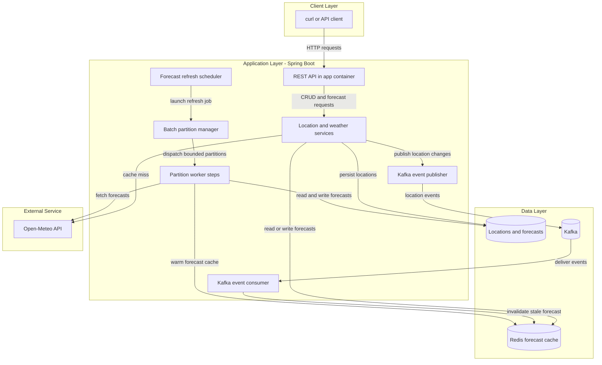

# Weather Watch

A small, disposable, containerized Spring Boot project proposal for a senior-engineering interview. It will demonstrate a REST API with CRUD, PostgreSQL persistence, Redis caching, Kafka events, scheduled partitioned Spring Batch forecast ingestion, and integration with the public [Open-Meteo API](https://open-meteo.com/).

> **Status:** Spring Boot and Docker Compose scaffold with saved-location CRUD and PostgreSQL persistence. Redis caching, Kafka events, Open-Meteo integration, scheduler, and partitioned batch job are still planned.
>
> **Project lifecycle:** This is an isolated interview showcase, not a production feature. It is not intended to be merged into `main` and may be deleted after the interview. These documents do not create Git isolation: the current workspace is inside an existing repository. Keep implementation in a separate disposable working copy if strict repository isolation is required.

## What we'll build

Users will manage saved weather locations through a small REST API. The application will store locations and forecast snapshots in PostgreSQL, retrieve forecasts from Open-Meteo, cache forecasts in Redis, and publish location-change events to Kafka. A scheduler will launch a partitioned Spring Batch job to refresh forecasts for saved locations on a configurable interval, processing location partitions with bounded concurrency. Docker Compose will run the application and its local infrastructure as containers for a repeatable demo and E2E test environment.

### Planned architecture

<!-- mermaid-checked: no \n, no em-dash/en-dash, no {} in labels, subgraphs are id["label"], arrows are -->|"label"|, all subgraphs closed by end, ids unique -->

```mermaid
flowchart TD
    subgraph Client["Client Layer"]
        Demo["curl or API client"]
    end
    subgraph App["Application Layer - Spring Boot"]
        Api["REST API in app container"]
        Service["Location and weather services"]
        Producer["Kafka event publisher"]
        Consumer["Kafka event consumer"]
        Scheduler["Forecast refresh scheduler"]
        Manager["Batch partition manager"]
        Worker["Partition worker steps"]
    end
    subgraph Data["Data Layer"]
        Pg[("Locations and forecasts")]
        Cache[("Redis forecast cache")]
        Kafka[("Kafka")]
    end
    subgraph External["External Service"]
        Meteo["Open-Meteo API"]
    end

    Demo -->|"HTTP requests"| Api
    Api -->|"CRUD and forecast requests"| Service
    Service -->|"persist locations"| Pg
    Service -->|"read or write forecasts"| Cache
    Service -->|"cache miss"| Meteo
    Service -->|"publish location changes"| Producer
    Producer -->|"location events"| Kafka
    Kafka -->|"deliver events"| Consumer
    Consumer -->|"invalidate stale forecast"| Cache
    Scheduler -->|"launch refresh job"| Manager
    Manager -->|"dispatch bounded partitions"| Worker
    Worker -->|"read and write forecasts"| Pg
    Worker -->|"fetch forecasts"| Meteo
    Worker -->|"warm forecast cache"| Cache
```

### Run and showcase

The local workflow uses Docker Compose to build and start the application, PostgreSQL, Redis, and Kafka together. Copy `.env.example` to `.env` if you want to override the documented local-only defaults, then run:

```sh
docker compose up --build -d
docker compose ps
curl http://localhost:8080/actuator/health/readiness
```

View application logs with `docker compose logs -f app`. Stop the stack while preserving normal demo data with `docker compose down`. To discard the local database, Redis, and Kafka data, use `docker compose down --volumes --remove-orphans`; this is destructive.

With the stack healthy:

1. Exercise the readiness endpoint and saved-location CRUD endpoints:

   | Method | Path | Purpose |
   |---|---|---|
   | `POST` | `/api/locations` | Create a location |
   | `GET` | `/api/locations` | List locations |
   | `GET` | `/api/locations/{id}` | Get one location |
   | `PUT` | `/api/locations/{id}` | Update a location |
   | `DELETE` | `/api/locations/{id}` | Delete a location |

2. Request a forecast twice and show that the second request is served from Redis.
3. Change a location and show the Kafka event being consumed and its cached forecast invalidated.
4. Trigger or wait for the scheduled Spring Batch job; show it dividing locations into partitions, processing those partitions with bounded concurrency, and persisting the results.
5. Run the end-to-end tests to demonstrate the API, persistence, cache, Kafka event flow, partitioned batch processing, and Open-Meteo integration together.

The app image exposes only the HTTP API on `127.0.0.1`; database, Redis, and Kafka ports remain private to the Compose network. See [the project brief](docs/interview-project.md) for containerization details, E2E cleanup steps, scope, progress, and the test plan.

The initial scaffold can also be tested locally with Java 21 and Maven:

```sh
mvn test
```

## Project documents

- [Project brief, scope, progress, and E2E test plan](docs/interview-project.md)
- [Proposed architecture and component relationships](.github/modernize/assessment/engines/facts/architecture-diagram.md)
