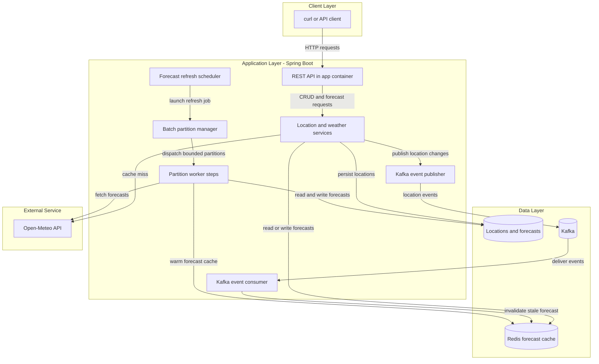

# Weather Watch

A small, disposable, containerized Spring Boot project proposal for a senior-engineering interview. It will demonstrate a REST API with CRUD, PostgreSQL persistence, Redis caching, Kafka events, scheduled partitioned Spring Batch forecast ingestion, and integration with the public [Open-Meteo API](https://open-meteo.com/).

> **Status:** Implemented saved-location CRUD, PostgreSQL persistence, Open-Meteo current forecasts, Redis caching, Kafka location events/cache invalidation, and a scheduled partitioned Spring Batch forecast refresh.
>
> **Project lifecycle:** This is an isolated interview showcase, not a production feature. It is not intended to be merged into `main` and may be deleted after the interview. These documents do not create Git isolation: the current workspace is inside an existing repository. Keep implementation in a separate disposable working copy if strict repository isolation is required.

## What it demonstrates

Users manage saved weather locations through a small REST API. The application stores locations and forecast snapshots in PostgreSQL, retrieves forecasts from Open-Meteo, caches forecasts in Redis, and publishes location-change events to Kafka. A scheduler launches a partitioned Spring Batch job to refresh forecasts for saved locations on a configurable interval, processing location partitions with bounded concurrency. Docker Compose runs the application and local infrastructure as containers for a repeatable demo and E2E test environment.

### Architecture

<!-- mermaid-checked: no \n, no em-dash/en-dash, no {} in labels, subgraphs are id["label"], arrows are -->|"label"|, all subgraphs closed by end, ids unique -->

```mermaid
flowchart TD
    subgraph Client["Client Layer"]
        Demo["curl or API client"]
    end
    subgraph App["Application Layer - Spring Boot"]
        Api["REST API in app container"]
        Service["Location and weather services"]
        Producer["Kafka event publisher"]
        Consumer["Kafka event consumer"]
        Scheduler["Forecast refresh scheduler"]
        Manager["Batch partition manager"]
        Worker["Partition worker steps"]
    end
    subgraph Data["Data Layer"]
        Pg[("Locations and forecasts")]
        Cache[("Redis forecast cache")]
        Kafka[("Kafka")]
    end
    subgraph External["External Service"]
        Meteo["Open-Meteo API"]
    end

    Demo -->|"HTTP requests"| Api
    Api -->|"CRUD and forecast requests"| Service
    Service -->|"persist locations"| Pg
    Service -->|"read or write forecasts"| Cache
    Service -->|"cache miss"| Meteo
    Service -->|"publish location changes"| Producer
    Producer -->|"location events"| Kafka
    Kafka -->|"deliver events"| Consumer
    Consumer -->|"invalidate stale forecast"| Cache
    Scheduler -->|"launch refresh job"| Manager
    Manager -->|"dispatch bounded partitions"| Worker
    Worker -->|"read and write forecasts"| Pg
    Worker -->|"fetch forecasts"| Meteo
    Worker -->|"warm forecast cache"| Cache
```

### Run and showcase

The local workflow uses Docker Compose to build and start the application, PostgreSQL, Redis, and Kafka together. Copy `.env.example` to `.env` if you want to override the documented local-only defaults, then run:

```sh
docker compose up --build -d
docker compose ps
curl http://localhost:8080/actuator/health/readiness
```

View application logs with `docker compose logs -f app`. Stop the stack while preserving normal demo data with `docker compose down`. To discard the local database, Redis, and Kafka data, use `docker compose down --volumes --remove-orphans`; this is destructive.

The scheduled refresh is enabled by default with a one-hour fixed delay. Adjust `WEATHER_BATCH_FIXED_DELAY`, `WEATHER_BATCH_GRID_SIZE`, `WEATHER_BATCH_MAX_WORKERS`, `WEATHER_BATCH_CHUNK_SIZE`, and `WEATHER_BATCH_RETRY_LIMIT` in `.env` to tune the demo. For deterministic API-only work, set `WEATHER_BATCH_ENABLED=false`.

With the stack healthy:

1. Exercise the readiness endpoint and saved-location CRUD endpoints:

   | Method | Path | Purpose |
   |---|---|---|
   | `POST` | `/api/locations` | Create a location |
   | `GET` | `/api/locations` | List locations |
   | `GET` | `/api/locations/{id}` | Get one location |
   | `PUT` | `/api/locations/{id}` | Update a location |
   | `DELETE` | `/api/locations/{id}` | Delete a location |

   Example create and forecast requests:

   ```sh
   curl -X POST http://localhost:8080/api/locations \
     -H "Content-Type: application/json" \
     -d '{"name":"Jakarta","latitude":-6.2,"longitude":106.8}'
   curl http://localhost:8080/api/locations/1/forecast
   ```

   The forecast example assumes a fresh database where the new record receives ID `1`; otherwise use the ID returned by `POST`.

2. Request a forecast twice; the first request calls Open-Meteo and caches its current conditions for 10 minutes, and the second request uses Redis.
3. Create, update, or delete a location and show its keyed Kafka event being consumed and its forecast cache entry invalidated. CRUD waits for broker acknowledgement; a publish failure returns `503` and rolls back the database operation.
4. Trigger or wait for the scheduled Spring Batch job; show it dividing locations into partitions, processing those partitions with bounded concurrency, persisting forecast snapshots, and warming Redis.
5. Run the end-to-end tests to demonstrate the API, persistence, cache, Kafka event flow, partitioned batch processing, and Open-Meteo integration together.

The app image exposes only the HTTP API on `127.0.0.1`; database, Redis, and Kafka ports remain private to the Compose network. See [the project brief](docs/interview-project.md) for containerization details, E2E cleanup steps, scope, progress, and the test plan.

Run the saved-location and forecast API tests locally with Java 21 and Maven:

```sh
mvn test
```

Run the isolated container-backed E2E flow from PowerShell:

```powershell
.\scripts\e2e.ps1
```

To run the POSIX `sh` implementation through the same entry point, use `-UseSh` (requires `sh` on `PATH`; Git Bash or MSYS2 provides it on Windows). `-UseBash` is also accepted as an alias:

```powershell
.\scripts\e2e.ps1 -UseSh
```

You can also run the POSIX shell script directly with `sh scripts/e2e.sh`.

It allocates a unique Compose project and host ports, stubs Open-Meteo, runs 15 scenarios (CRUD, validation, cache reuse and TTL expiry, Kafka invalidation, events and outage rollback, provider failure and timeout, partitioned/scheduled batch, retry and permanent failure) and prints a pass/fail table, then removes only that run's containers, network, and volumes. On failure it prints service logs before cleanup.

## Project documents

- [Project brief, scope, progress, and E2E test plan](docs/interview-project.md)
- [Proposed architecture and component relationships](.github/modernize/assessment/engines/facts/architecture-diagram.md)
