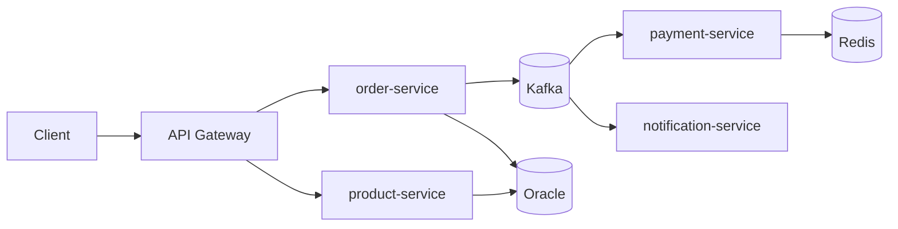

# Personal Notes — Order Management Platform

Reference notes for the portfolio build. Domain: e-commerce order processing.

## Required backend-concept coverage

This portfolio must fully demonstrate the following concepts. Completion means
the implementation, automated tests, E2E reproduction steps, and documentation
exist; configuring a library without proving its behavior is not sufficient.

| Concept | Project implementation and proof |
|---|---|
| Synchronous programming | REST request/response flows through the gateway; validation, Problem Details errors, database transactions, and synchronous catalog/payment interactions are covered by unit, API, and E2E tests. |
| Asynchronous programming | Transactional outbox relays publish Kafka events after commits; payment/order/notification consumers use at-least-once delivery with idempotent inbox or Redis deduplication. Duplicate delivery is E2E tested. |
| Design patterns | Hexagonal ports/adapters and repository ports isolate business logic; payment methods use Strategy dispatch; outbox/inbox, cache-aside, and circuit-breaker/retry policies solve specific distributed-system concerns. |
| Saga pattern | Required completion: an orchestrated, durable order process coordinates inventory reservation, payment, and fulfillment. Each command/event is idempotent; failures compensate completed work by releasing inventory and refunding/reversing payment where appropriate. E2E tests must cover success, rejection, retry, timeout, and failure after payment. The current outbox/inbox event flow is not a Saga because it has no process coordinator or compensations. |
| Containerization | Each service has a multi-stage, non-root image; Docker Compose supplies a reproducible full-stack local runtime. |
| Orchestration | Helm deploys the platform to Kubernetes with resource limits, startup/liveness/readiness probes, HPA, and a full gateway-based cluster E2E flow. |
| CI/CD | CI builds, tests, produces coverage artifacts, and builds images. Required completion: immutable GHCR publication plus a protected, approved staging Helm deployment using pinned image digests/tags, smoke tests, and documented rollback. |
| Multithreading and concurrency | Virtual threads, scheduled outbox relay work, and connection-pool limits establish runtime foundations. Required completion: bounded Kafka listener concurrency, partition-order behavior, race-safe idempotency, coordinated parallel-request tests, and concurrency metrics. |
| Caching | product-service uses Redis cache-aside reads, TTL, evict-on-write invalidation, cache miss/hit E2E tests, and a documented fail-open Redis-outage policy. |

## Target role checklist → what to build

| Requirement | Deliverable |
|---|---|
| Java & Spring Boot | Spring Boot 3.x, Java 21 (records, virtual threads) |
| REST API | OpenAPI 3, Bean Validation, pagination, RFC 7807 problem+json errors |
| Oracle + SQL optimization | Indexed/partitioned schema, EXPLAIN PLAN before/after writeup, HikariCP tuning, batch inserts |
| Microservices | 4 services, service discovery, config, Resilience4j (circuit breaker, retry, bulkhead) |
| JUnit/Mockito | Unit + integration tests (Testcontainers), JaCoCo ≥ 80%, PIT mutation testing |
| Design Patterns & Clean Code | Strategy (payments), Factory, Observer (events), Hexagonal architecture, ArchUnit layering tests |
| Docker & CI/CD | Multi-stage Dockerfile, docker-compose, GitHub Actions build/test/coverage/image, GHCR publication, protected staging Helm deployment, smoke test, rollback |
| Messaging and distributed transactions | Kafka with **outbox pattern** for reliable event publishing; orchestrated Saga with explicit compensations for long-running order fulfillment |
| Redis (bonus) | Catalog caching, rate limiting |
| Kubernetes/Cloud (bonus) | Helm chart, probes, HPA, Minikube/kind or free-tier cloud |

## Architecture

## The differentiators (what actually wins the interview)

1. **README as a case study** — architecture diagram, ADRs, tradeoffs (why Kafka over RabbitMQ, why outbox pattern).
2. **Performance section** — k6/Gatling load test; SQL optimization before/after with real numbers.
3. **Observability** — structured logs, Micrometer + Prometheus + Grafana, OpenTelemetry tracing.
4. **Security** — JWT/OAuth2 resource server, secrets via env vars / Vault, never in code.
5. **Zero-downtime design** — Flyway migrations, backward-compatible API versioning, graceful shutdown.

## Build order (2–3 weeks part-time)

1. Core: order-service + product-service + Oracle + Flyway + REST + tests
2. Kafka event flow + payment/notification services + outbox pattern
3. Inventory/payment/fulfillment Saga with compensations and failure recovery
4. Dockerize + docker-compose + CI/CD delivery pipeline
5. Kubernetes + observability
6. Polish README, diagrams, ADRs — **this is the interview material; spend real time here**

## Cheap bonus wins

- Demo video/GIF in the README
- Live deployment on a free tier
- "Known limitations / next steps" section — self-aware tradeoffs read senior

## Interview talking points to prepare

- Why outbox pattern solves dual-write problem (DB + Kafka consistency)
- Idempotent consumers (dedup keys, exactly-once vs at-least-once)
- Why the current outbox/inbox flow is not a Saga; orchestrator versus
  choreography; compensation versus database rollback; and why the order
  workflow uses an orchestrated Saga
- SQL tuning story: slow query → EXPLAIN PLAN → index/partition → measured improvement
- Circuit breaker: when it trips, fallback strategy, half-open recovery
- Hexagonal architecture: ports/adapters, why testability improves
- Virtual threads: when they help vs platform threads in I/O-heavy services
