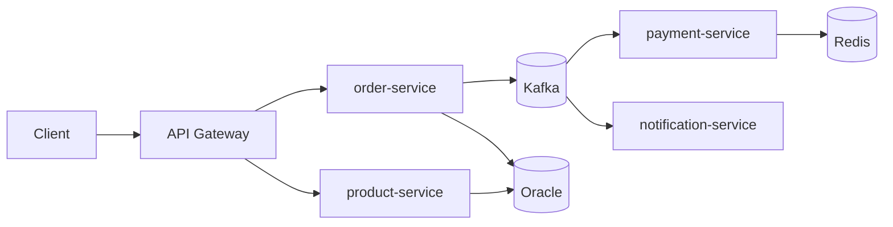

# Personal Notes — Order Management Platform

Reference notes for the portfolio build. Domain: e-commerce order processing.

## Target role checklist → what to build

| Requirement | Deliverable |
|---|---|
| Java & Spring Boot | Spring Boot 3.x, Java 21 (records, virtual threads) |
| REST API | OpenAPI 3, Bean Validation, pagination, RFC 7807 problem+json errors |
| Oracle + SQL optimization | Indexed/partitioned schema, EXPLAIN PLAN before/after writeup, HikariCP tuning, batch inserts |
| Microservices | 4 services, service discovery, config, Resilience4j (circuit breaker, retry, bulkhead) |
| JUnit/Mockito | Unit + integration tests (Testcontainers), JaCoCo ≥ 80%, PIT mutation testing |
| Design Patterns & Clean Code | Strategy (payments), Factory, Observer (events), Hexagonal architecture, ArchUnit layering tests |
| Docker & CI/CD | Multi-stage Dockerfile, docker-compose, GitHub Actions (build → test → Sonar → image → registry) |
| Messaging (bonus) | Kafka with **outbox pattern** for reliable event publishing |
| Redis (bonus) | Catalog caching, rate limiting |
| Kubernetes/Cloud (bonus) | Helm chart, probes, HPA, Minikube/kind or free-tier cloud |

## Architecture

## The differentiators (what actually wins the interview)

1. **README as a case study** — architecture diagram, ADRs, tradeoffs (why Kafka over RabbitMQ, why outbox pattern).
2. **Performance section** — k6/Gatling load test; SQL optimization before/after with real numbers.
3. **Observability** — structured logs, Micrometer + Prometheus + Grafana, OpenTelemetry tracing.
4. **Security** — JWT/OAuth2 resource server, secrets via env vars / Vault, never in code.
5. **Zero-downtime design** — Flyway migrations, backward-compatible API versioning, graceful shutdown.

## Build order (2–3 weeks part-time)

1. Core: order-service + product-service + Oracle + Flyway + REST + tests
2. Kafka event flow + payment/notification services + outbox pattern
3. Dockerize + docker-compose + CI pipeline
4. Kubernetes + observability
5. Polish README, diagrams, ADRs — **this is the interview material; spend real time here**

## Cheap bonus wins

- Demo video/GIF in the README
- Live deployment on a free tier
- "Known limitations / next steps" section — self-aware tradeoffs read senior

## Interview talking points to prepare

- Why outbox pattern solves dual-write problem (DB + Kafka consistency)
- Idempotent consumers (dedup keys, exactly-once vs at-least-once)
- SQL tuning story: slow query → EXPLAIN PLAN → index/partition → measured improvement
- Circuit breaker: when it trips, fallback strategy, half-open recovery
- Hexagonal architecture: ports/adapters, why testability improves
- Virtual threads: when they help vs platform threads in I/O-heavy services
