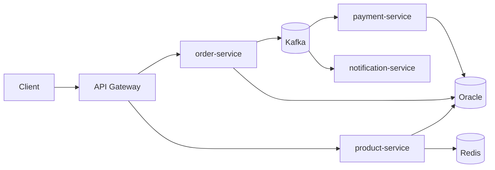

# Personal Notes — Order Management Platform

Reference notes for the portfolio build. Domain: e-commerce order processing.

## Required backend-concept coverage

This portfolio must fully demonstrate the following concepts. Completion means
the implementation, automated tests, E2E reproduction steps, and documentation
exist; configuring a library without proving its behavior is not sufficient.

| Concept | Project implementation and proof |
|---|---|
| Synchronous programming | REST request/response flows through the gateway; validation, Problem Details errors, database transactions, and synchronous catalog/payment interactions are covered by unit, API, and E2E tests. |
| Asynchronous programming | Transactional outbox relays publish Kafka events after commits; payment/order/notification consumers use at-least-once delivery with idempotent inbox or Redis deduplication. Duplicate delivery is E2E tested. |
| Design patterns | Hexagonal ports/adapters and repository ports isolate business logic; payment methods use Strategy dispatch; outbox/inbox, cache-aside, and circuit-breaker/retry policies solve specific distributed-system concerns. |
| Saga pattern | Required completion: an orchestrated, durable order process coordinates inventory reservation, payment, and fulfillment. Each command/event is idempotent; failures compensate completed work by releasing inventory and refunding/reversing payment where appropriate. E2E tests must cover success, rejection, retry, timeout, and failure after payment. The current outbox/inbox event flow is not a Saga because it has no process coordinator or compensations. |
| Containerization | Each service has a multi-stage, non-root image; Docker Compose supplies a reproducible full-stack local runtime. |
| Orchestration | Helm deploys the platform to Kubernetes with resource limits, startup/liveness/readiness probes, HPA, and a full gateway-based cluster E2E flow. |
| CI/CD | CI builds, tests, produces coverage artifacts, and builds images. Required completion: immutable GHCR publication plus a protected, approved staging Helm deployment using pinned image digests/tags, smoke tests, and documented rollback. |
| Multithreading and concurrency | Virtual threads, scheduled outbox relay work, and connection-pool limits establish runtime foundations. Required completion: bounded Kafka listener concurrency, partition-order behavior, race-safe idempotency, coordinated parallel-request tests, and concurrency metrics. |
| Extreme concurrency / flash sale | Required completion: limited-stock inventory reservation with one authoritative atomic decrement/conditional update or equivalent transactionally safe reservation, idempotency keys, reservation expiry/release, oversell prevention, contention controls, and a high-parallelism E2E/load test proving successful reservations never exceed stock. |
| Caching | product-service uses Redis cache-aside reads, TTL, evict-on-write invalidation, cache miss/hit E2E tests, and a documented fail-open Redis-outage policy. |
| Distributed rate limiting | Required completion: gateway-level Redis-backed token buckets shared by all gateway replicas. Limit login by IP plus normalized username hash, anonymous reads by IP, authenticated writes by JWT subject, and flash-sale reservations by subject plus sale/product. Return `429` and `Retry-After`, exclude health/metrics, emit allowed/rejected/error metrics, test burst/refill and two-user fairness, and explicitly test Redis outage policy: fail closed for login and flash-sale reservation; fail open only for ordinary catalog reads if documented. |
| Resource efficiency and capacity | Required completion: a reproducible local-laptop case study, not a production-capacity claim. Record hardware, Docker Desktop/minikube allocation, JVM/container limits, dataset, warm-up, VUs, duration, and background load. Under the same conditions, compare CPU, container/process memory, GC, HikariCP, Kafka lag, throughput, p50/p95/p99, failures, and Kubernetes CPU throttling/HPA data where available before and after one targeted improvement. |

## Authentication and authorization coverage

| Concept | Current implementation |
|---|---|
| Credential authentication | `auth-service` accepts demo username/password credentials and issues a short-lived access token. Users are in memory for the portfolio demo. |
| JWT | Tokens carry standard issuer, subject, issued-at, expiry, and unique `jti` claims, plus a custom `roles` claim. |
| Public/private-key cryptography | `auth-service` generates an RSA-2048 key pair and signs JWTs with the private key using RS256. The private key never leaves auth-service; resource servers verify signatures with the public key. |
| JWKS | `GET /oauth2/jwks` exposes the public RSA key in standard JSON Web Key Set format with `kid`, `kty`, `n`, `e`, `alg`, and signature-use metadata. |
| OAuth2 resource server | The gateway and order/product/payment services use OAuth2 resource-server JWT validation. The gateway validates at the edge; services validate again for defense in depth. |
| Role-based access control | The `roles` claim maps to `ROLE_*` authorities. Customer-only payments/order creation, customer-or-admin order reads, admin-only product writes, and public catalog reads are enforced and web-layer tested. |
| Stateless API security | CSRF is disabled for the bearer-token APIs; protected routes require a valid JWT and unauthenticated/unauthorized paths are tested. |
| Required authorization-server milestone | Replace the custom issuer with a mature standards-based OAuth2/OIDC authorization server, rather than implementing protocol flows or token cryptography from scratch. It must provide authorization-code flow with PKCE, registered clients, OIDC discovery, UserInfo, persistent signing keys with safe rotation, refresh-token rotation, and issuer/audience/scope validation by every resource server. |
| Deliberate non-goals | Do not add deprecated Resource Owner Password Credentials, dynamic client registration, device flow, federation/SAML, social login, multi-tenancy, opaque-token introspection, or custom cryptography unless a real platform requirement is introduced. |

### Authorization-server verification

The OAuth2/OIDC milestone is complete only when a registered public client can
complete an authorization-code flow with PKCE and use the resulting access
token through the gateway and a protected resource service. Verification must
also prove:

- OIDC discovery and JWKS expose the issuer's active public signing key;
- an ID token and UserInfo response contain the intended identity claims;
- expired, wrong-issuer, wrong-audience, and insufficient-scope tokens are
  rejected at the gateway and resource-server boundaries;
- refresh-token rotation issues a replacement token and rejects reuse of the
  rotated token;
- a signing-key rotation keeps existing valid requests working during the
  published-key overlap;
- persistent users, registered clients, grants, and signing-key metadata
  survive an auth-service restart;
- the Compose and Kubernetes paths run the same critical authorization flow.

## Target role checklist → what to build

| Requirement | Deliverable |
|---|---|
| Java & Spring Boot | Spring Boot 3.x, Java 21 (records, virtual threads) |
| REST API and security | Bean Validation, pagination, RFC 7807 problem+json errors; current RS256 JWTs/JWKS/resource-server validation/RBAC; required OAuth2/OIDC authorization server with authorization code + PKCE |
| Oracle + SQL optimization | Versioned Flyway migrations, constraints and indexes, EXPLAIN PLAN before/after evidence, HikariCP sizing, and a required laptop-sized resource-efficiency study |
| Microservices | Six services with explicit static routing/configuration, Kafka eventing, and Resilience4j retry/circuit breaker; service discovery and bulkhead isolation are not currently implemented or claimed |
| JUnit/Mockito | JUnit/Mockito application tests, MVC security tests, ArchUnit tests, JaCoCo reports, and 100% focused PIT for order/payment/product application/domain logic; Testcontainers and a global JaCoCo threshold are not currently implemented or claimed |
| Design Patterns & Clean Code | Strategy (payments), event-driven Observer-style consumers, Hexagonal architecture, repository ports/adapters, transactional outbox/inbox, cache-aside, circuit-breaker/retry, and planned Saga orchestration |
| Docker & CI/CD | Multi-stage Dockerfile, docker-compose, GitHub Actions build/test/coverage/image, GHCR publication, protected staging Helm deployment, smoke test, rollback |
| Messaging and distributed transactions | Kafka with **outbox pattern** for reliable event publishing; orchestrated Saga with explicit compensations for long-running order fulfillment |
| Redis | Catalog cache-aside is implemented; distributed gateway rate limiting is required |
| Kubernetes/Cloud (bonus) | Helm chart, probes, HPA, Minikube/kind or free-tier cloud |

## Distributed rate-limiting verification

The rate-limiting milestone is complete only when the gateway demonstrates:

- a configured burst allowance followed by sustained token refill;
- `429 Too Many Requests` with `Retry-After` after the applicable quota is
  exhausted;
- independent quotas for two authenticated users;
- a quota that remains shared after traffic is routed through separate gateway
  replicas;
- the intended identity key for each route type without retaining raw
  passwords or credentials;
- explicit Redis failure behavior: reject login and flash-sale requests when
  fairness/correctness cannot be enforced, while ordinary catalog reads may
  fail open only when that policy is explicitly justified and observable;
- Prometheus metrics for permitted, rejected, and limiter-backend-error
  requests; and
- Docker Compose and Kubernetes E2E evidence, including a flash-sale load run
  that shows the limiter protects downstream resources without violating stock
  correctness.

## Architecture

## The differentiators (what actually wins the interview)

1. **README as a case study** — architecture diagram, ADRs, tradeoffs (why Kafka over RabbitMQ, why outbox pattern).
2. **Performance section** — k6/Gatling load test; SQL optimization before/after with real numbers.
3. **Observability** — structured logs, Micrometer + Prometheus + Grafana, OpenTelemetry tracing.
4. **Security** — JWT/OAuth2 resource server, secrets via env vars / Vault, never in code.
5. **Delivery hardening** — versioned Flyway migrations are implemented;
   backward-compatible API evolution and graceful shutdown remain required
   considerations for the CI/CD and deployment milestones.

## Remaining delivery order

The platform foundation, Docker Compose, Kubernetes, observability, baseline
performance study, and focused PIT work are complete. Finish the remaining
implementation in this order:

1. Inventory/payment/fulfillment Saga with compensations and failure recovery.
2. CI/CD delivery: immutable GHCR images, protected staging deployment, smoke
   testing, and rollback.
3. Concurrency hardening: bounded listeners, ordering, race-safe idempotency,
   coordinated parallel tests, and metrics.
4. Limited-stock flash-sale reservation with high-contention proof.
5. Distributed gateway rate limiting.
6. Regression verification across the completed reliability/concurrency work.
7. OAuth2/OIDC authorization server and Compose/Kubernetes verification.
8. Regression verification after the OAuth2/OIDC migration.
9. Laptop-sized resource-efficiency/capacity case study.
10. Final regression verification, then implementation-backed ADRs, README
    diagrams, demo media, and publishing polish.

## Cheap bonus wins

- Demo video/GIF in the README
- Live deployment on a free tier
- "Known limitations / next steps" section — self-aware tradeoffs read senior

## Interview talking points to prepare

- Why outbox pattern solves dual-write problem (DB + Kafka consistency)
- Idempotent consumers (dedup keys, exactly-once vs at-least-once)
- Why the current outbox/inbox flow is not a Saga; orchestrator versus
  choreography; compensation versus database rollback; and why the order
  workflow uses an orchestrated Saga
- Flash-sale consistency: why the reservation operation is atomic, how
  idempotency and expiry prevent overselling, and how contention results are
  verified under high parallelism
- RS256/JWKS: private-key signing, public-key verification, key identifiers,
  JWT claims, OAuth2 resource-server validation, and why the current custom
  issuer is being replaced by a full OAuth2/OIDC authorization server
- OAuth2/OIDC: authorization-code flow, PKCE, ID versus access tokens,
  issuer/audience/scopes, discovery, refresh-token rotation, and signing-key
  rotation; and the boundary between resource-server validation and a full
  OAuth2/OIDC authorization server
- SQL tuning story: slow query → EXPLAIN PLAN → index/partition → measured improvement
- Circuit breaker: when it trips, fallback strategy, half-open recovery
- Hexagonal architecture: ports/adapters, why testability improves
- Virtual threads: when they help vs platform threads in I/O-heavy services
